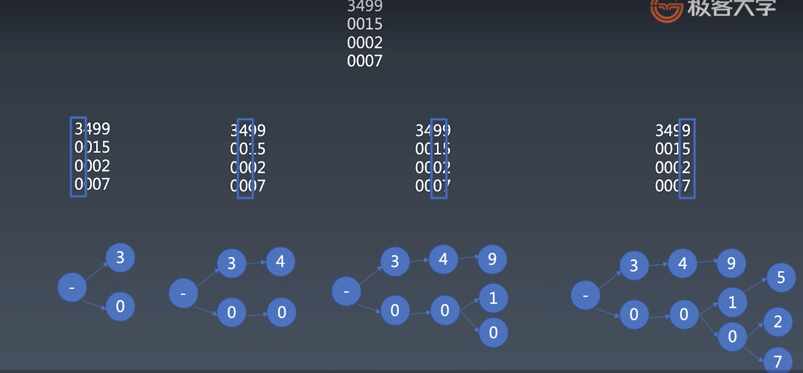

## 字符串分析算法
  ### 字典树
  大量高重复字符串的存储与分析
  

  ### KMP
  在长字符串里找短字符串，模式匹配算法

  ### wildcard
  带通配符的字符串模式

    abc*cd*abc*a?d
    上面例子中，最后一个*号可以尽可能地匹配多字符，在最后一个*之前的*号，应尽量少匹配。*匹配任意数量的任意字符，？匹配任意字符
  
  ### 正则
  字符串通用模式匹配
  ### 状态机
  通用的字符串分析，比正则更强大些，可以嵌代码
  ### LL LR
  字符串多层结构分析
